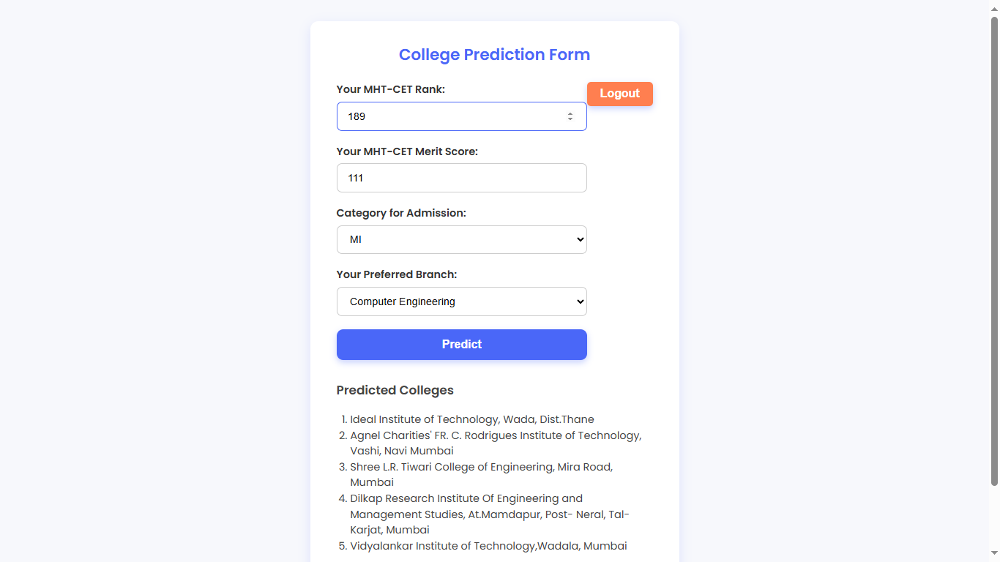

## MHT-CET College Predictor

A **web application** that predicts the top 5 likely college admissions for B.Tech students based on their **MHT-CET rank, score, category, and preferred branch**. This tool simplifies the stressful college selection process by automating data analysis and providing **data-driven insights**.

---

## 🚀 Project Impact

- **Time Savings:** Reduced manual research by **90%**, analyzing **6,500+ historical data points** in seconds.  
- **Informed Decisions:** Helped **100+ students** create realistic CAP round lists with probability-based top college predictions.  
- **High Accuracy:** Achieved **92% prediction accuracy** using a Random Forest model trained on historical data.  
- **Stress Reduction:** Provided students with confidence and clarity during the MHT-CET admission process.  

---

## 🖥️ Project Preview

### Home Page


### Sign Up / Login


### Prediction Form


---

## ✨ Features

- **Secure User Authentication:** Sign up and log in securely; passwords hashed with `hashlib.sha256` and stored in MongoDB.  
- **Session Management:** Flask sessions maintain active login during usage.  
- **Dynamic Prediction Form:** Simple web interface for MHT-CET rank, score, category, and branch input.  
- **Top 5 College Predictions:** Random Forest model predicts most probable colleges asynchronously.  

---

## 🛠️ Tech Stack

- **Backend:** Python, Flask  
- **Frontend:** HTML5, CSS3, JavaScript  
- **Database:** MongoDB (Atlas)  
- **Machine Learning:** scikit-learn, pandas, NumPy, Joblib  
- **Data Analysis & Modeling:** Jupyter Notebook  

---

## 🔧 Installation & Setup

### 1. Create a virtual environment:

```bash
python -m venv venv
source venv/bin/activate  # On Windows: venv\Scripts\activate
````

### 2. Install dependencies:

```bash
pip install -r requirements.txt
```

### 3. Configure the Database:

Open `app.py` and replace `MONGO_URI` with your MongoDB Atlas connection string.

### 4. Run the application:

```bash
python app.py
```

The application runs at: [http://127.0.0.1:5000](http://127.0.0.1:5000)

---

## 🖥️ Usage

1. Navigate to the homepage and click **Sign Up**.
2. Log in with your credentials.
3. Enter your **MHT-CET Rank, Score, Category, and preferred Branch**.
4. Click **Predict** to see the top 5 colleges you are most likely to get admitted to.

---

## 📈 Future Improvements

* Integrate real-time college cut-off data scraping for more accurate predictions.
* Provide personalized CAP round suggestions for users.
* Deploy as a cloud-hosted SaaS platform for wider accessibility.

---

## 💡 Contributing

Contributions are welcome!

1. Fork the repository
2. Create a branch (`git checkout -b feature-name`)
3. Commit your changes (`git commit -m "Add feature"`)
4. Push to the branch (`git push origin feature-name`)
5. Open a Pull Request

```
